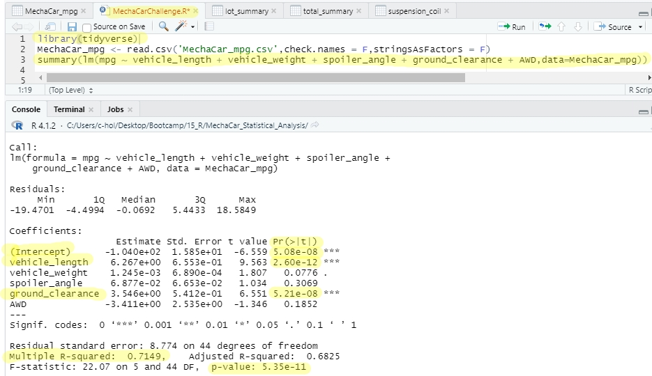

## Background
A few weeks after starting his new role, Jeremy is approached by upper management about a special project. AutosRUs’ newest prototype, the MechaCar, is suffering from production troubles that are blocking the manufacturing team’s progress. AutosRUs’ upper management has called on Jeremy and the data analytics team to review the production data for insights that may help the manufacturing team.

## Programs used
- R v.4.1.2
- R Studio v.2022.02.0_Build443
- R studio’s tidyverse v.1.3.1

## Linear Regression to Predict MPG

Dataset: [MechaCar_mpg.csv](MechaCar_mpg.csv)

### **Which variables/coefficients provided a non-random amount of variance to the mpg values in the dataset?**
 - Vehicle Length, Ground Clearance, the Intercept. “Pr(>|t|)” represents the probability that each coefficient contributes a random amount of variance to the linear model. According to our results, vehicle length & ground clearance (as well as intercept) are statistically unlikely to provide random amounts of variance to the linear model. In other words the vehicle length & ground clearance have a significant impact on fuel efficiency (mpg).

### **Is the slope of the linear model considered to be zero? Why or why not?**
 - No. The p-value of our linear regression analysis is 5.35 x 10-11, which is much smaller than our assumed significance level of 0.05%. Therefore, we can state that there is sufficient evidence to reject our null hypothesis, which means that the slope of our linear model is not zero.

### **Does this linear model predict mpg of MechaCar prototypes effectively? Why or why not?**
 - No. Although as a race car enthusiast they’ve hit the big points here with the current variables lack of significant variables means predictability of fuel efficiency would improve if more data (variables) were added to this dataset. This is known as “overfitting” (or lack of significant variables).  

  
## Summary Statistics

Dataset: [Suspension_Coil.csv](Suspension_Coil.csv)

### **The design specifications for the MechaCar suspension coils dictate that the variance of the suspension coils must not exceed 100 pounds per square inch.** 
 - The current manufacturing data DOES meet this design specification for all manufacturing lots in total, with a Variance of 62.

 - But NOT for each lot individually because lot 3 is at a variance of 170, 70% over the limit!

  
## T-Tests on Suspension Coils

### **Determine if the PSI across all manufacturing lots is statistically different from the population mean of 1,500 pounds per square inch.**

Using a normal significance level of 0.05, 
 - Ho: There is no statistical difference between the sample and the population means.
 - Ha: Ho: There is statistical difference between the sample and the population means.

**The population**: p-value = .06028 > .05 
 - we do not have sufficient evidence to reject our null hypothesis / 
 - we fail to reject our null hypothesis / 
 - There is no statistical difference between the sample and the population means/
 - the two means are statistically SIMILAR

**The sample**: p-value = .3758 > .05 
 - we do not have sufficient evidence to reject our null hypothesis / 
 - we fail to reject our null hypothesis / 
 - There is no statistical difference between the sample and the population means/
 - the two means are statistically SIMILAR

### **Determine if the PSI for each manufacturing lot is statistically different from the population mean of 1,500 pounds per square inch.**

Using a normal significance level of 0.05, 
 - Ho: There is no statistical difference between the manufacturing lot and the population means.
 - Ha: Ho: There is statistical difference between the manufacturing lot and the population means.

**Lot 1**: p-value = 1.0 > .05 
 - we do not have sufficient evidence to reject our null hypothesis / 
 - we fail to reject our null hypothesis / 
 - There is no statistical difference between the sample and the population means/
 - the two means are statistically SIMILAR

**Lot 2**: p-value = 0.6072 > .05   
 - we do not have sufficient evidence to reject our null hypothesis / 
 - we fail to reject our null hypothesis / 
 - There is no statistical difference between the sample and the population means/
 - the two means are statistically SIMILAR

**Lot 3**: p-value = 0.04168 < .05 
 - we have sufficient evidence to reject our null hypothesis / 
 - we reject our null hypothesis / 
 - There is statistical difference between the sample and the population means
 - the two means are statistically DIFFERENT 

Lot 3 is the only mean that can be explained by random chance. Some questions to ask would be:
 - Are there any outliers in lot 3? If so, is it incorrect data that we can omit?
 - Is it necessary to care if lot 3 is statistically different? What if it is okay for a PSI to be in the same range that they are in, but to build our car we just want better PSI to make the best performing car possible?
  
## Study Design: MechaCar vs Competition
Design a statistical study to compare performance of the MechaCar vehicles against performance of vehicles from other manufacturers.

1. If I were buying a car and comparing the MechaCar manufacturer spec to other car manufacturers, these metrics would be of interest to a consumer:
   - Overall Safety rating
   - Available Warranty length
   - Total Recalls YOY
   - Cost of Standard features 
   - Avg number of repairs for vehicles under 120k miles
   - Customer Satisfaction Ratings
   - Green / Renewable Energy Rating
   - Are the production line employees Unionized?
   - Pledge to go carbon neutral 
   - Pledge to go completely electric 

2. The hippy in me would start by filtering out all the manufacturers who have not pledged to go carbon neutral OR go completely electric. 

3. Then, I would test the average Customer Satisfaction Rating of MechaCar compared to the competitor.  An overall Customer Satisfaction Rating should encompass most of the other metrics listed above and is given directly by the consumer. They ultimate question to ask is, “Would they purchase from this manufacturer again?” 

4. I would use a high significance level of 0.01, because buying a vehicle is a large purchase and needs to be dependable to get back and forth from your income source (work/job) typically. There are also safety factors involved (lives at stake) in the event of an automobile accident. 
   - The null hypothesis (Ho) would be: There is no statistical difference between the average Customer Satisfaction Rating of MechaCar compared to the competition.
   - The alternate hypothesis (Ha) would be: There is statistical difference between the average Customer Satisfaction Rating of MechaCar compared to the competition.

5. My end goal would be to show an array of all the different manufacturers compared to each other. This way you can easily pick out the highest rating in relation to other personal emotional factors such as: Is there a dealership nearby for those free carwashes and convenience of maintenance check-ups like oil changes?  
    1. To do this, I would first get a dataset of vehicles that listed customer satisfaction scores and manufacturer. I would want it to be a large dataset with a variety of US and international manufacturers.  
    2. Then I would create an array of the summary stats using the group_by & summarize functions. 
    3. Then, perform a simple t-Test on each individual competitor to see if there is any statistical difference 

